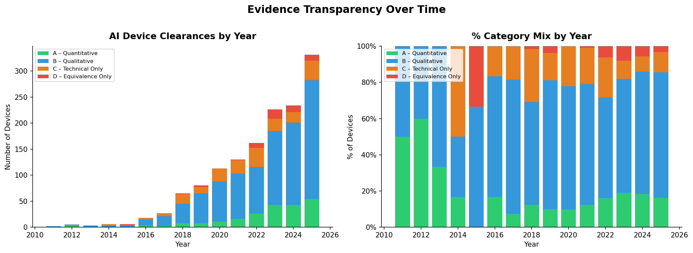
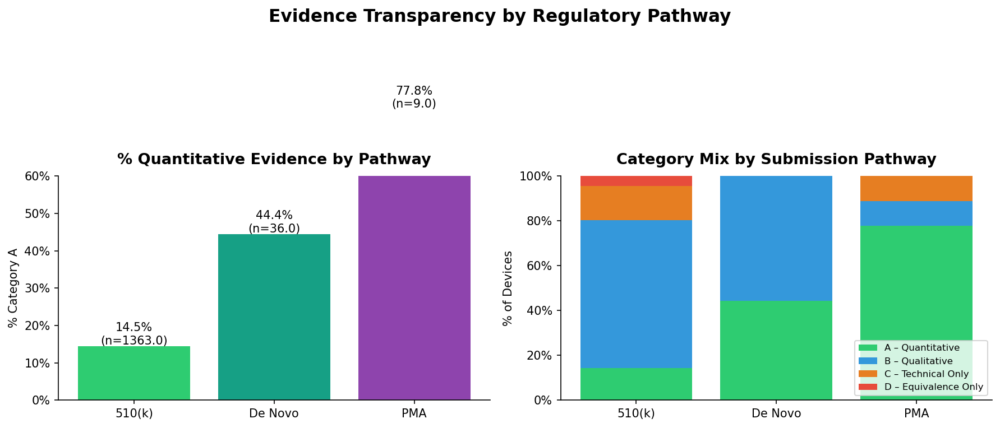
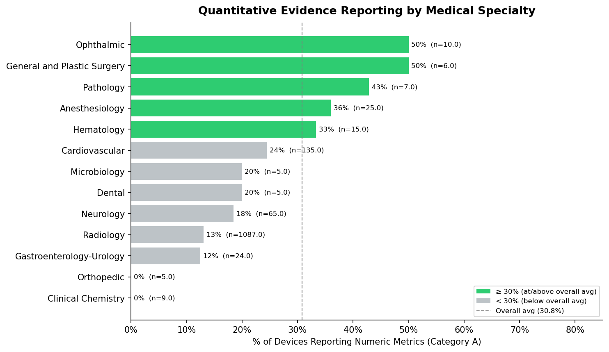
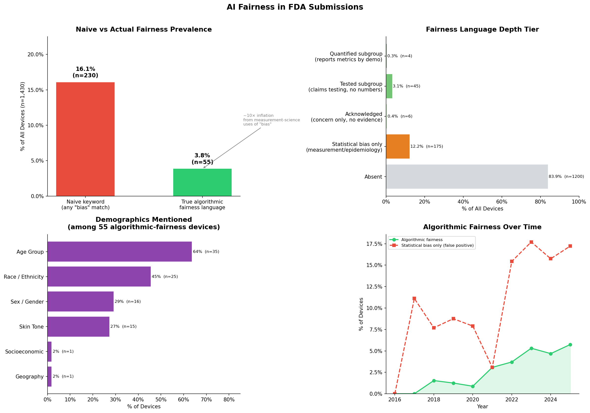
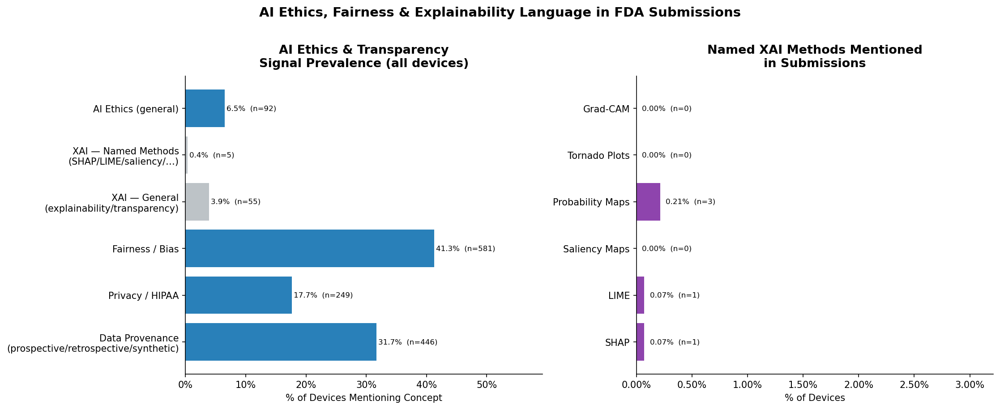
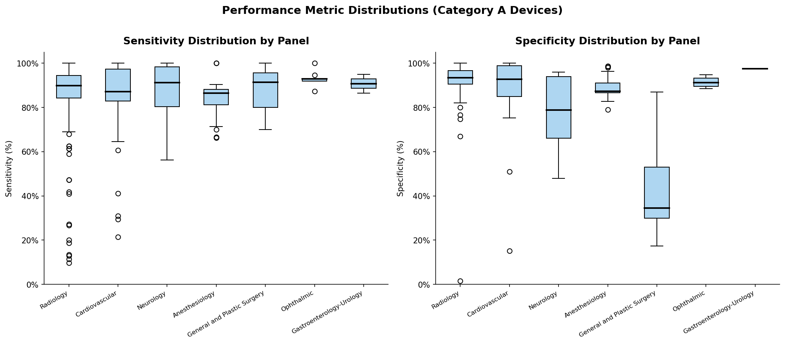

# FDA AI Medical Device Evidence Transparency

**A systematic analysis of 1,430 AI-powered medical devices cleared by the U.S. Food and Drug Administration (FDA), examining how manufacturers report — or fail to report — the evidence behind their products.**

---

## The Core Finding

When a hospital buys an AI system to detect cancer in X-rays, diagnose heart conditions from an ECG, or flag sepsis in an ICU, clinicians need to know: *how well does this actually work, and in whom?*

This project analyzed every AI medical device cleared by the FDA through early 2025 and found that **only 15.6% of them (220 out of 1,408) report extractable numeric performance data** — sensitivity, specificity, accuracy, or similar metrics — in their regulatory submissions. The rest describe their testing in vague terms, reference benchmarks without numbers, or provide no clinical performance data at all.

More strikingly, **only 4 devices out of 1,430 (0.3%) report performance broken down by patient demographics** — meaning we have almost no systematic evidence on whether these AI systems work equally well across races, sexes, or age groups.

---

## Table of Contents

1. [Background — What Is an AI Medical Device?](#background)
2. [Key Findings at a Glance](#key-findings)
3. [The Evidence Categories](#evidence-categories)
4. [Findings in Detail](#findings-in-detail)
   - [The Transparency Gap](#1-the-transparency-gap)
   - [Regulatory Pathway Is the Strongest Predictor](#2-regulatory-pathway-is-the-strongest-predictor)
   - [The Radiology Paradox](#3-the-radiology-paradox)
   - [Transparency Has Not Improved Over Time](#4-transparency-has-not-improved-over-time)
   - [Fairness Language Is Mostly Absent — and Often Misleading](#5-fairness-language-is-mostly-absent-and-often-misleading)
   - [When Numbers Are Reported, Performance Looks High](#6-when-numbers-are-reported-performance-looks-high)
5. [How the Analysis Works](#how-the-analysis-works)
6. [Reproducing This Analysis](#reproducing-this-analysis)
7. [Project Structure](#project-structure)
8. [Data Sources](#data-sources)
9. [Limitations](#limitations)

---

## Background

### What Is an AI Medical Device?

A medical device that uses artificial intelligence (AI) or machine learning (ML) to achieve its intended clinical purpose. Examples include:

- An algorithm that reads chest X-rays and flags possible lung nodules
- Software that analyzes ECG signals and detects atrial fibrillation
- A system that predicts patient deterioration from ICU vital signs
- An AI tool that screens pathology slides for cancer cells

### Why Do These Devices Need FDA Clearance?

In the United States, software that influences clinical decisions is regulated by the FDA as a medical device. Before a company can sell such a product, it must submit evidence that the device is safe and effective. The most common approval route is a **510(k) submission**, where the manufacturer argues their device is "substantially equivalent" to an already-cleared product. More novel devices go through a more rigorous pathway called **De Novo**, and the most scrutinized pathway — for high-risk devices — is a full **Pre-Market Approval (PMA)**.

### Why Does This Analysis Matter?

Clinicians using AI tools need to know their performance characteristics to make informed decisions. Patients need assurance these tools work for people who look like them. Regulators need empirical data to set evidence standards. And researchers studying AI in healthcare need a population-level view — not just individual case studies.

This project provides that view for the first time, to the best of our knowledge, across all 1,430 FDA-cleared AI devices.

---

## Key Findings at a Glance

| Finding | Number |
|---|---|
| Total AI medical devices analyzed | **1,430** |
| Devices with readable regulatory submissions | **1,408 (98.5%)** |
| Devices reporting numeric performance metrics | **220 (15.6%)** |
| Devices with only vague qualitative descriptions | **920 (65.3%)** |
| Devices reporting only bench/technical tests | **209 (14.8%)** |
| Devices relying purely on a previous device's data | **59 (4.2%)** |
| Devices with genuine AI fairness analysis | **55 (3.9%)** |
| Devices that report performance *by* demographic group | **4 (0.3%)** |

---

## Evidence Categories

To make sense of 1,430 submissions, each device was classified into one of four evidence categories based on the types of performance data present in its regulatory filing.

### Category A — Quantitative *(220 devices, 15.6%)*
The submission reports specific numeric outcomes from clinical testing. Examples:
> *"The algorithm achieved a sensitivity of 92.3% (95% CI: 89.1–94.8%) and specificity of 87.6% in a retrospective study of 1,247 cases."*

This is the most informative category. A clinician reading this submission knows exactly how well the device performed and in what kind of study.

### Category B — Qualitative *(920 devices, 65.3%)*
The submission mentions that clinical testing occurred, but gives no numbers. Examples:
> *"Clinical performance was evaluated in a multi-site study. The device met all pre-specified performance criteria."*

This is the most common category. Testing happened — we just can't see the results.

### Category C — Technical Only *(209 devices, 14.8%)*
The submission describes only engineering or laboratory tests, not tests on actual patients or clinical data. Examples:
> *"Performance testing was conducted using NEMA phantoms. Image quality metrics including CNR and MTF met specifications."*

This category is dominated by radiology devices where image processing quality, not clinical outcome, was the main focus.

### Category D — Equivalence Only *(59 devices, 4.2%)*
The submission makes no claim of new testing. Instead, it argues the device is equivalent to a previously cleared product and relies entirely on that product's data. Examples:
> *"The subject device has the same intended use and technological characteristics as the predicate device (K123456)."*

---

## Findings in Detail

### 1. The Transparency Gap

Less than one in six AI medical devices provides numeric performance data in its FDA submission.



The left chart shows raw device counts by year — the AI medical device market has grown dramatically, from fewer than 10 clearances per year before 2015 to over 300 in 2025. The right chart shows category proportions: the dominant color is blue (Category B — qualitative), meaning most devices at every point in time describe testing without reporting results.

---

### 2. Regulatory Pathway Is the Strongest Predictor

The single biggest factor determining whether a device reports quantitative data is *which regulatory pathway it went through* — not the technology itself, not the medical specialty, not the year.



| Pathway | Devices | Report Numbers |
|---|---|---|
| PMA (most rigorous) | 9 | **77.8%** |
| De Novo (novel devices) | 36 | **44.4%** |
| 510(k) (most common) | 1,363 | **14.5%** |

The interpretation is straightforward: companies disclose performance data when regulators require it. The 510(k) pathway — which covers 95% of all AI devices — sets a lower evidentiary bar, and manufacturers meet that bar and no more.

---

### 3. The Radiology Paradox

Radiology accounts for **1,087 of the 1,430 devices (76%)** — by far the largest specialty. Yet radiology devices report quantitative performance data at only **13.1%**, well below the overall average.



This is counterintuitive. Image-based AI — detecting tumors, measuring bone density, flagging pneumonia — is the area where one would most expect clean, measurable performance data. Several explanations are plausible:

- Many radiology AI tools are positioned as "workflow" aids rather than diagnostic conclusions, reducing the perceived need for clinical outcome data
- Radiology has the deepest tradition of 510(k) submissions where substantial equivalence to a predicate is sufficient
- The sheer volume of radiology submissions may include many lower-stakes applications

Specialties with smaller device counts tend to show higher quantitative rates — Anesthesiology (36%), Hematology (33%), Cardiovascular (24%) — though these smaller samples should be interpreted cautiously.

---

### 4. Transparency Has Not Improved Over Time

Despite growing public and regulatory attention to AI accountability, the *proportion* of devices reporting quantitative data has remained essentially flat over the past decade — hovering between 10% and 19% across years.

The absolute number of quantitative submissions has grown (because total submissions have grown), but the rate has not. This suggests the growth of the AI medical device market has been led by products that provide minimal clinical evidence, rather than by an increase in rigor.

---

### 5. Fairness Language Is Mostly Absent — and Often Misleading

A naive search for "fairness" and "bias" language suggests that 40.9% of submissions (581 devices) mention these concepts. **This figure is misleading.**



A closer analysis shows the vast majority of those mentions are statistical or measurement uses of the word "bias" — a technical term in clinical chemistry and epidemiology completely unrelated to algorithmic fairness. For example:

- *"CLSI EP15-A3, User Verification of Precision and **Estimation of Bias**"* — a lab measurement standard
- *"The results met acceptance criteria on mean score shift (**bias**) of T1 and T2"* — analytical chemistry

Once these false positives are removed, the corrected picture is:

| Depth of Fairness Engagement | Devices | % of Total |
|---|---|---|
| Reports actual performance numbers by demographic group | **4** | 0.3% |
| Claims fairness testing was done (no numbers reported) | **45** | 3.1% |
| Mentions algorithmic fairness as a concern (no evidence of testing) | **6** | 0.4% |
| "Bias" used only in statistical/measurement sense | **175** | 12.2% |
| No relevant fairness language at all | **1,200** | 83.9% |

Among the 55 devices with genuine AI fairness language, the most commonly mentioned demographic factors are age (64%), race/ethnicity (45%), and skin tone (27%) — the latter likely driven by dermatology and ophthalmology AI.



The right panel of this figure illustrates the near-total absence of named explainability methods. Techniques like SHAP, LIME, Grad-CAM, and saliency maps — widely used in AI research to explain model decisions — appear in fewer than 0.5% of submissions.

---

### 6. When Numbers Are Reported, Performance Looks High

For the 220 devices that do report numeric data, the extracted values suggest strong performance — but with important caveats.



| Metric | Average | Median | # of extractions |
|---|---|---|---|
| Sensitivity | 85.0% | — | 331 |
| Specificity | 85.1% | — | 308 |
| AUC | 0.92 | — | 118 |
| Accuracy | 85.2% | — | 34 |
| PPV | 66.6% | — | 30 |
| NPV | 84.0% | — | 25 |

**Caveat:** These numbers come from manufacturer-submitted data, not independent validation. Publication bias likely applies — devices that performed poorly in testing may have been redesigned before submission, or may have been classified as Category B by their manufacturers (describing testing but omitting the numbers).

---

## How the Analysis Works

This project processes the publicly available FDA regulatory submissions entirely automatically. No manual review of individual documents was required.

```
FDA official AI/ML device list (1,430 devices)
        │
        ▼
For each device: fetch the PDF submission document
from the FDA public server (no download — streamed live)
        │
        ▼
Extract the text from the PDF
        │
        ▼
Classify evidence type (A / B / C / D)
using keyword and pattern matching
        │
        ▼
For Category A devices: extract specific metric values
(sensitivity, specificity, AUC, confidence intervals)
        │
        ▼
For all devices: scan for AI ethics, fairness,
and explainability language — then re-analyze
to separate genuine fairness from statistical noise
        │
        ▼
Store everything in a structured database (SQLite)
        │
        ▼
Generate figures and export summary CSVs
```

**Key technical choices:**
- PDFs are streamed from FDA servers without local storage — no large file downloads needed
- Extracted text is cached locally so subsequent analyses (ethics, fairness) run instantly without re-fetching
- All classification uses pattern matching and keyword detection — no machine learning model was trained
- The SQLite database is self-contained and portable

---

## Reproducing This Analysis

### Requirements

```
Python 3.9+
```

Install dependencies:

```bash
pip install -r requirements.txt
```

### Step-by-step

The pipeline runs in five sequential steps. Each step is resumable — if interrupted, it picks up where it left off.

**Step 1 — Classify all 1,430 devices** *(~1 hour, requires internet)*
Downloads and classifies each device's submission PDF.

```bash
cd FDA_AIeMD_DB
python scripts/batch_classify_all_devices.py
```

**Step 2 — Extract numeric metrics from Category A devices** *(~15 min, requires internet)*
For the ~220 devices in Category A, extracts specific metric values and confidence intervals.

```bash
python scripts/extract_quantitative_metrics.py
```

**Step 3 — Extract AI ethics and fairness signals** *(~2 min, cache-only)*
Scans all documents for ethics, fairness, privacy, and explainability language.

```bash
python scripts/extract_ai_ethics_signals.py
```

**Step 4 — Analyze fairness depth** *(~1 min, cache-only)*
Distinguishes genuine algorithmic fairness language from statistical false positives.

```bash
python scripts/analyze_fairness_depth.py
```

**Step 5 — Generate all figures and summary tables** *(~30 seconds)*
Produces all charts in `reports/` and summary CSVs in `data/`.

```bash
python scripts/analyze_trends.py
```

### Output files

| File | Contents |
|---|---|
| `data/fda_classifications.db` | Complete SQLite database with all results |
| `data/summary_temporal.csv` | Category breakdown by year |
| `data/summary_panel.csv` | Category breakdown by medical specialty |
| `data/summary_pathway.csv` | Category breakdown by regulatory pathway |
| `data/summary_company.csv` | Top companies by device count and transparency rate |
| `data/quantitative_metrics_extracted.csv` | All extracted metric values with context |
| `data/fairness_depth.csv` | Fairness classification for all devices with context snippets |
| `reports/fig_01_temporal_trends.png` | Evidence category mix over time |
| `reports/fig_02_panel_transparency.png` | Quantitative rate by medical specialty |
| `reports/fig_03_pathway_analysis.png` | Transparency by regulatory pathway |
| `reports/fig_04_metric_distributions.png` | Sensitivity/specificity distributions by specialty |
| `reports/fig_05_auc_distribution.png` | AUC distribution across Category A devices |
| `reports/fig_06_category_c_radiology.png` | Bench-only evidence concentration in radiology |
| `reports/fig_07_company_transparency.png` | Top 20 companies by device count vs transparency |
| `reports/fig_08_ci_reporting.png` | Confidence interval reporting rates |
| `reports/fig_09_ethics_prevalence.png` | AI ethics signal prevalence |
| `reports/fig_10_ethics_by_panel_time.png` | Ethics language by specialty and over time |
| `reports/fig_11_fairness_depth.png` | Corrected fairness analysis with depth tiers |

---

## Project Structure

```
FDA_AIeMD_DB/
│
├── data/
│   ├── fda_ai_devices.csv              ← Source list of 1,430 AI devices (from FDA)
│   ├── fda_classifications.db          ← Complete SQLite results database
│   ├── text_cache/                     ← Cached PDF text (one .txt file per device)
│   ├── summary_*.csv                   ← Summary tables for each analysis dimension
│   ├── quantitative_metrics_extracted.csv
│   └── fairness_depth.csv
│
├── src/                                ← Core reusable modules
│   ├── pdf_processor.py                ← PDF fetching, text extraction, caching
│   ├── evidence_classifier.py          ← A/B/C/D classification logic
│   ├── keyword_analyzer.py             ← Performance metric pattern matching
│   └── ai_ethics_analyzer.py           ← Ethics/fairness/XAI keyword detection
│
├── scripts/                            ← Pipeline steps (run in order)
│   ├── batch_classify_all_devices.py   ← Step 1: classify all 1,430 devices
│   ├── extract_quantitative_metrics.py ← Step 2: extract metric values (Cat A)
│   ├── extract_ai_ethics_signals.py    ← Step 3: ethics/fairness/XAI signals
│   ├── analyze_fairness_depth.py       ← Step 4: correct for false-positive fairness flags
│   └── analyze_trends.py              ← Step 5: generate all figures and summaries
│
├── reports/                            ← Generated figures (fig_01 through fig_11)
│
├── config.py
├── requirements.txt
└── README.md
```

---

## Data Sources

- **Device list**: [FDA Artificial Intelligence and Machine Learning (AI/ML)-Enabled Medical Devices](https://www.fda.gov/medical-devices/software-medical-device-samd/artificial-intelligence-and-machine-learning-aiml-enabled-medical-devices) — the official FDA list, updated periodically. The version used here was retrieved in early 2025 and contains 1,430 devices.
- **Submission documents**: Retrieved programmatically from the FDA's public document server (`accessdata.fda.gov`) using each device's submission number (e.g., K253532, DEN200070, P210014). These are the actual regulatory filings manufacturers submitted to the FDA.

All source data is publicly available. No proprietary or restricted data was used.

---

## Limitations

**1. Text extraction quality**
22 of 1,430 submissions (1.5%) could not be analyzed because the PDFs contained scanned images rather than searchable text. Some submissions also embed key data in tables or figures that are not captured in the text layer.

**2. Pattern-based classification**
The A/B/C/D classification uses keyword and regex pattern matching, not a trained AI model. Creative or unusual phrasing may occasionally be missed. We estimate classification accuracy is high for clear cases (confident Category A and B) but less certain for borderline cases.

**3. Manufacturer-reported data only**
All performance metrics come from the manufacturers' own submissions. These are not independently verified. Publication bias likely applies — unfavorable results may have been omitted or the device redesigned before final submission.

**4. One document per device**
This analysis reads the primary decision document for each submission. Some manufacturers submit detailed clinical data in supplemental appendices that were not captured here. This means our Category A rate may undercount actual quantitative reporting.

**5. 510(k) vs PMA comparison**
PMA devices serve fundamentally different clinical contexts than 510(k) devices (higher-risk, more novel technology). The transparency gap between pathways partly reflects genuine regulatory differences rather than just manufacturer choices.

**6. Snapshot in time**
The FDA device list and individual submissions change over time. Results reflect the dataset as of early 2025.

---

*Analysis conducted as part of a systematic review of AI evidence transparency in medical device regulation.*
*All source data is publicly available from the U.S. Food and Drug Administration.*

---

## Acknowledgements

This repository was developed with the assistance of Claude Sonnet 4.6, which supported code review, pipeline development, and document formatting throughout the project.
